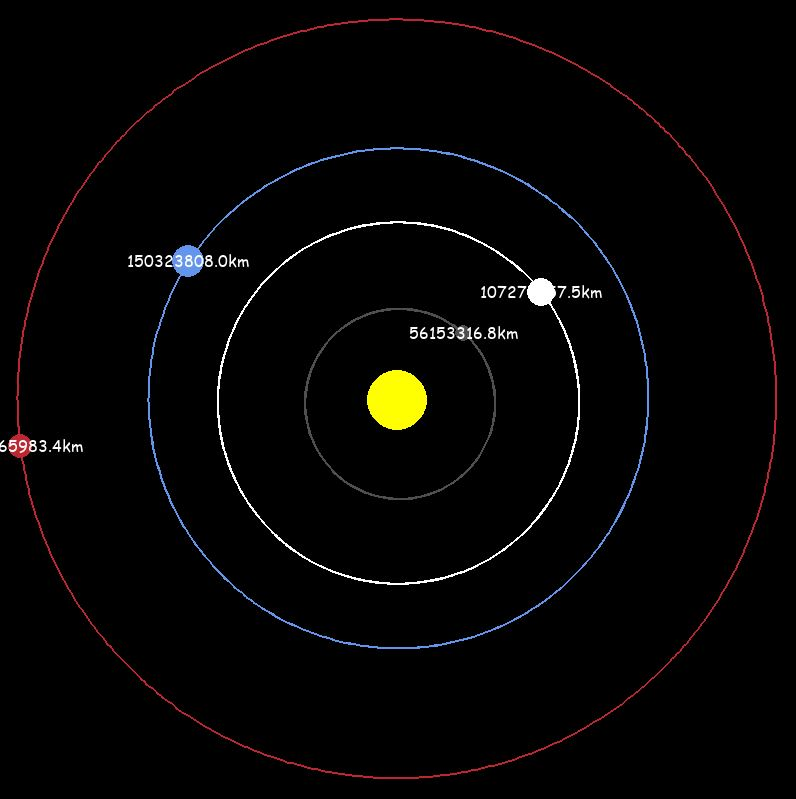

# Solar System Simulation

## Overview

This project is a simple simulation of the solar system using Python and Pygame. It visualizes the orbits of various planets around a central sun, demonstrating gravitational forces and orbital mechanics.

